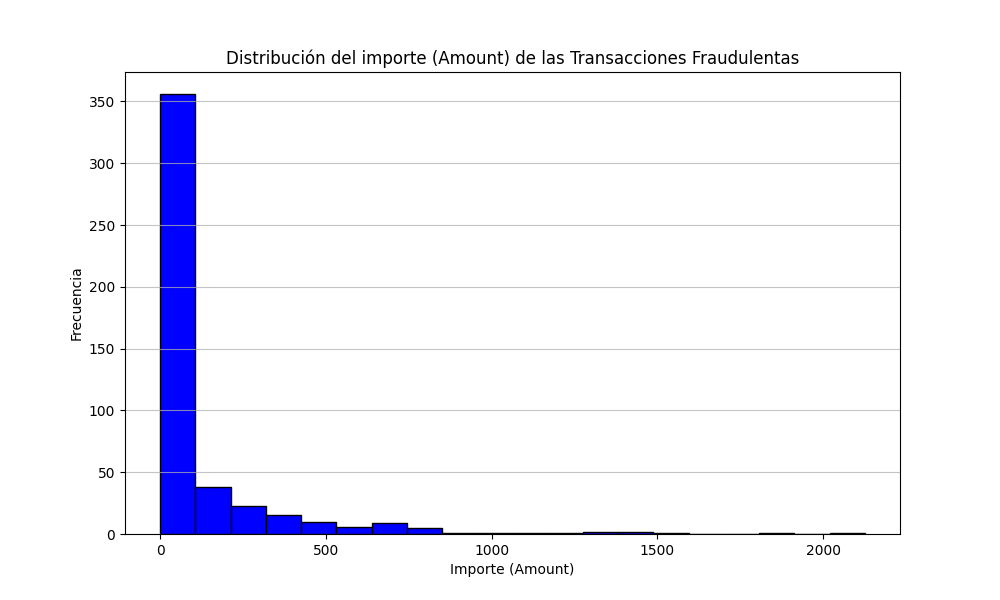
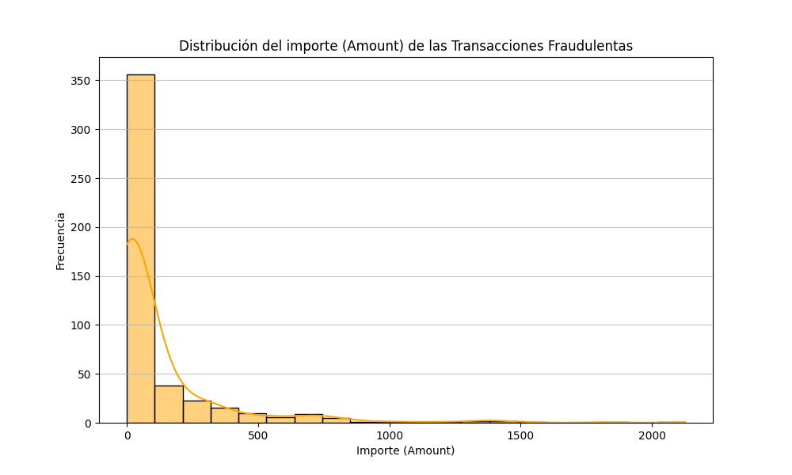
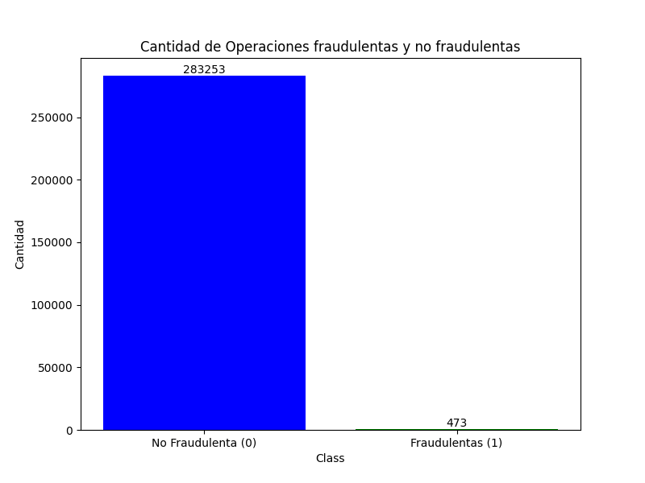
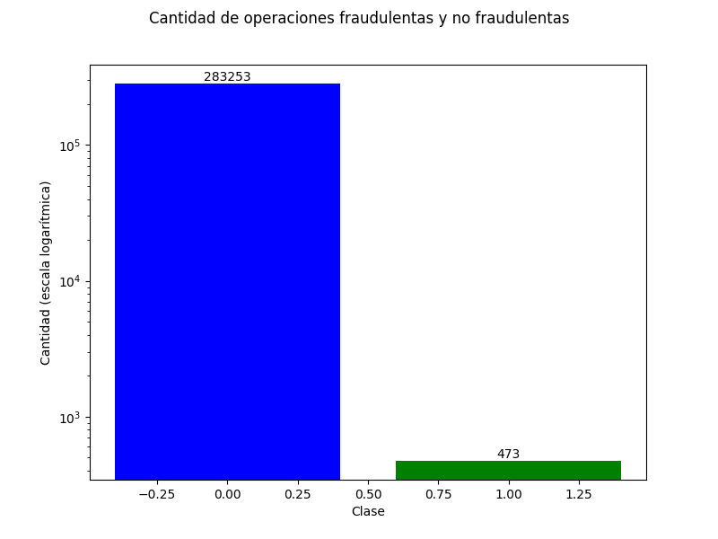
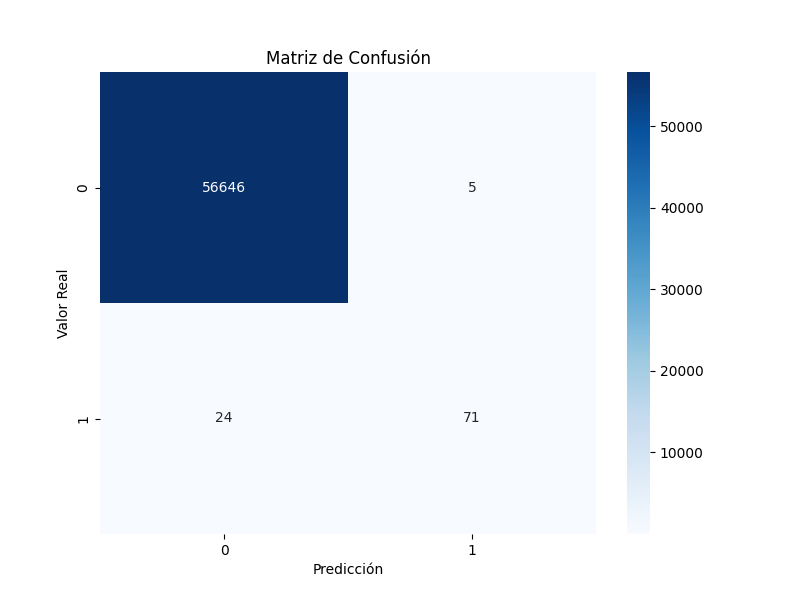

# 💳 DETECCIÓN DE FRAUDES EN TARJETAS DE CRÉDITO

Proyecto realizado para el curso de **Programa de Aprendizaje Basado en Proyectos en Inteligencia Artificial** de IBM en septiembre de 2024.

## 📂 Datos

El archivo de datos utilizado para este proyecto se encuentra disponible en el repositorio y puede descargarse desde [este enlace](./ruta/del/archivo.csv).  
Asegúrate de clonar el repositorio y tener el archivo en el mismo directorio para ejecutar correctamente el notebook. 


## 🔍 Objetivo

Este proyecto tiene como objetivo desarrollar un sistema de detección de fraudes en transacciones de tarjetas de crédito, empleando técnicas de Machine Learning para identificar transacciones fraudulentas y reducir riesgos en operaciones financieras.

---

## 📑 Tabla de Contenidos

1. [Introducción](#introducción)
2. [Descripción del Proyecto](#descripción-del-proyecto)
3. [Análisis Exploratorio de Datos (EDA)](#análisis-exploratorio-de-datos-eda)
4. [Modelado y Técnicas Empleadas](#modelado-y-técnicas-empleadas)
5. [Evaluación de Métricas](#evaluación-de-métricas)
6. [Conclusiones](#conclusiones)
7. [Instrucciones de Ejecución](#instrucciones-de-ejecución)

---

## 📝 Introducción

El fraude con tarjetas de crédito representa un desafío crítico en el ámbito financiero, debido a las pérdidas económicas y al impacto en la confianza de los clientes. Este proyecto aborda este problema mediante el uso de modelos de Machine Learning que detectan patrones anómalos en las transacciones, permitiendo así reducir el riesgo de fraude de forma automatizada y eficiente.

---

## 🗂️ Descripción del Proyecto

El conjunto de datos contiene transacciones de tarjetas de crédito, donde cada transacción está clasificada como fraudulenta o no fraudulenta. La variable objetivo (`Class`) indica si una transacción es legítima (`0`) o fraudulenta (`1`). La proporción entre transacciones legítimas y fraudulentas es altamente desbalanceada, lo cual representa un reto para el modelado.

---

## 📊 Análisis Exploratorio de Datos (EDA)

Durante el EDA se realizó un análisis detallado de las características y distribuciones de las transacciones para comprender mejor los factores que pueden diferenciar las transacciones legítimas de las fraudulentas.

1. **Distribución de los importes de Transacción**: El gráfico de distribución de los importes de las transacciones muestra diferencias en la frecuencia entre transacciones fraudulentas y legítimas, lo cual puede ser un indicador importante en la detección de fraude.

   
   
      

2. **Balance de Clases**: Dada la naturaleza desbalanceada del conjunto de datos, se presentan gráficos para visualizar la proporción entre transacciones legítimas y fraudulentas. También se emplea una escala logarítmica para observar mejor la distribución de cada clase en términos de su cantidad.

   
   
   

---

## 🤖 Modelado y Técnicas Empleadas

Para identificar transacciones fraudulentas, se probaron múltiples algoritmos de Machine Learning. Los modelos principales incluyen:

- **Random Forest**: Se entrenó un modelo de Random Forest debido a su capacidad para manejar datos desbalanceados y captar relaciones complejas.
- **Regresión Logística**: Un enfoque tradicional y efectivo en la clasificación binaria.
- **Máquinas de Soporte Vectorial (SVM)**: También se evaluó, especialmente útil en problemas de clasificación.

Cada modelo fue ajustado y evaluado en base a su precisión para identificar fraudes, con técnicas de sobremuestreo para compensar el desbalance de clases en los datos.

---

## 📈 Evaluación de Métricas

Para evaluar el rendimiento de los modelos, se emplearon las siguientes métricas:

- **Precisión (Accuracy)**: Indica la proporción de predicciones correctas sobre el total de predicciones.
- **Sensibilidad (Recall)**: Mide la proporción de transacciones fraudulentas correctamente identificadas.
- **Puntuación F1 (F1-Score)**: Promedia precisión y recall, siendo particularmente útil en problemas de datos desbalanceados.

La **matriz de confusión** fue utilizada para observar los aciertos y errores en cada clase, permitiendo identificar áreas de mejora en el modelo.

   

---

## 🔍 Conclusiones

El modelo final muestra un rendimiento robusto y adecuado para la detección de fraudes en transacciones de tarjetas de crédito. Se recomienda actualizar y mejorar el modelo de forma periódica, debido a que los patrones de fraude tienden a evolucionar con el tiempo y pueden volverse más sofisticados.

---

## ⚙️ Instrucciones de Ejecución

### Prerrequisitos

- Python 3.x
- Jupyter Notebook
- Bibliotecas: `pandas`, `numpy`, `matplotlib`, `seaborn`, `scikit-learn`

### Instalación

1. Clona este repositorio:
   ```bash
   git clone https://github.com/tu_usuario/tu_repositorio.git
